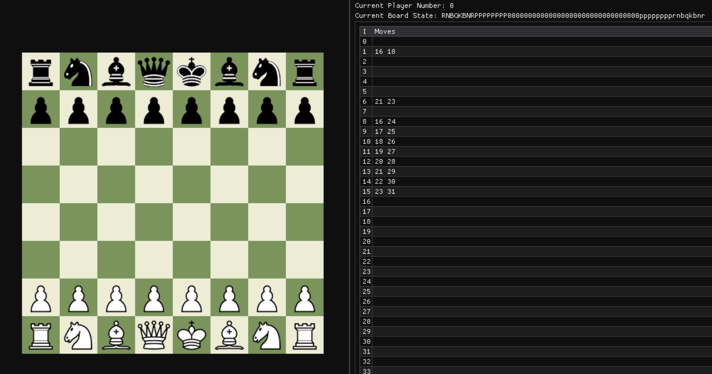

# Spebby's Chess AI



## 🎯 Project Overview
A very rudamentry Chess program (and eventually, AI) based on Graeme Devine's [skeleton code](https://github.com/Spebby/CMPM123-Chess/commits/95c448471543cbf7a933316e770efa8766cd0943/), given a graphical interface with [Dear ImGui](https://github.com/ocornut/imgui/tree/docking). This is the final project for the CMPM-123's Fall '24 Quarter at the University of California, Santa Cruz.

### 🎓 Educational Purpose
This project serves as a teaching tool for computer science students to understand:
- Game state representation
- Object-oriented design in C++
- Basic AI concepts in game playing
- Bitboard operations and chess piece movement
- FEN (Forsyth–Edwards Notation) for chess position representation

## 🔧 Technical Architecture

### Key Components
1. **Chess Class**: Core game logic implementation
   - Board state management
   - Move validation
   - Game state evaluation
   - AI player implementation

2. **Piece Representation**
   - Unique identifiers for each piece type
   - Sprite loading and rendering
   - Movement pattern definitions

3. **Board Management**
   - 8x8 grid representation
   - Piece positioning
   - Move history tracking
   - FEN notation support

## 🚀 Getting Started

### Prerequisites
- C++ compiler with C++11 support or higher
- Image loading library for piece sprites
- CMake 3.2 or higher

### Building the Project
```bash
mkdir build
cd build
cmake ..
make
```

### Running Tests
```bash
./chess_tests
```

## 📝 Implementation Details

### Current Features
- Basic board setup and initialization
- Piece movement validation framework
    - No current support for En Passant and Castling.
- FEN notation parsing and generation
- Sprite loading for chess pieces
- Player turn management

### Planned Features
- [ ] Support for En Passant and Castling
- [ ] AI move generation
- [ ] Position evaluation
- [ ] Opening book integration
- [ ] Advanced search algorithms
- [ ] Game state persistence
- [ ] Rudimentary Bitboards

## 🔍 Code Examples

### Piece Movement Validation
```cpp
bool Chess::canBitMoveFrom(Bit& bit, ChessSquare& src) {
	if (_moves.count(src.getIndex())) {
		return true;
	}
	return false;
}

bool Chess::canBitMoveFromTo(Bit& bit, ChessSquare& src, ChessSquare& dst) {
	const int i = srcSquare.getIndex();
	const int j = dstSquare.getIndex();
	for (int pos : _moves[i]) {
		if (pos == j) {
			return true;
		}
	}

	return false;
}
```

Validating that a player's attempted move is simple enough, but building a list of legal moves is harder. For convenience, generated moves for a given position are stored in a hashtable for convenience and quick lookup. While the move generator does not currently check for check (and thus, does not limit "psuedo-illegal" moves), it does generate all moves fairly efficiently for a non-bitboard approach, nix-En Passant and Castling.

### FEN Notation Generation

FEN notation for an individual position is computed and cached when a piece moves to a new holder.

```cpp
inline char generateNotation(ChessBit* abit) {
	if (abit) {
		const char* w = { "PNBRQK" };
		const char* b = { "pnbrqk" };
		// get the non-coloured piece
		int piece = abit->gameTag() & 7;
		return 8 & abit->gameTag() ? b[piece - 1] : w[piece - 1];
	}
	return '0';
}
```

```cpp
std::string Chess::stateString() {
	std::string s;
	for (int i = 0; i < _gameOps.size; i++) {
		s += _grid[i].getNotation();
	}

	return s;
}
```

## 📚 Class Assignment Structure

### Phase 1: Board Setup
- Implement piece placement
- Setup initial board state
- Validate board representation

### Phase 2: Move Generation
- Implement basic piece movements
- Add move validation
- Implement special moves (castling, en passant)

### Phase 3: AI Implementation
- Develop position evaluation
- Implement minimax algorithm
- Add alpha-beta pruning
- Basic opening book

## 📄 License
This project is licensed under the MIT License.

## 👥 Contributors
- Graeme Devine - Initial Framework
- Thom Mott - Implementation and testing

## 🙏 Acknowledgments
- Chess piece sprites from [Wikipedia](https://en.wikipedia.org/wiki/Chess_piece)
- Original game engine framework by [ocornut](https://github.com/ocornut/imgui)

---
*This README is part of an educational project and is intended to serve as an example of good documentation practices.*